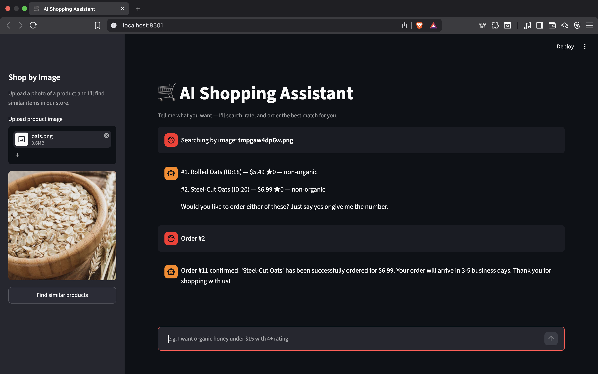
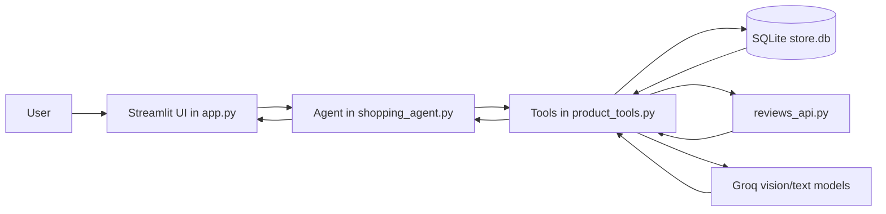

# Shopping Agent

## What It Does

Shopping Agent is a Streamlit-based AI shopping assistant that helps users find products from a small SQLite-backed catalog. It can:

- search products by natural language, price, and organic status
- look up product ratings from stored reviews
- analyze an uploaded product image and search for similar items
- place an order only after explicit user confirmation

The app is designed around a modular tool workflow, where the LLM decides when to search, rate, inspect an image, or checkout.

## Project Showcase



## Basic Architecture

The project is split into a few focused layers:

- `app.py` is the Streamlit UI layer. It handles chat input, image upload, and rendering assistant responses.
- `shopping_agent.py` defines the agent, connects the LLM, and sets the system prompt and guardrails.
- `product_tools.py` exposes the agent tools for product search, ratings, checkout, and image analysis.
- `store_db.py` contains the SQLite access layer for reading products and writing orders.
- `reviews_api.py` reads review data and returns rating summaries for products.
- `setup_db.py` creates and seeds the database tables and sample data.

Basic flow:



## How to Run It

1. Activate the virtual environment:

```bash
source ShoppingAgent-VENV/bin/activate
```

2. Install dependencies if needed:

```bash
pip install -r requirements.txt
```

3. Create or refresh the SQLite database:

```bash
python project_shopping_agent/setup_db.py
```

4. Set your Groq API key so the agent can call the LLM:

```bash
export groqapikey="your_api_key_here"
```

5. Start the app:

```bash
streamlit run project_shopping_agent/app.py
```

## What I Learned

- DB interaction: I learned how to use SQLite as the persistent layer for products, reviews, and orders, including querying data, calculating ratings, and writing new orders safely.
- Guardrails implementation: I learned how to keep the agent from ordering too early by forcing an explicit user confirmation before checkout and by requiring the product ID to come from the assistant’s own prior search results.
- Modular workflow: I learned how to split the system into focused pieces, with the UI, agent logic, database access, review aggregation, and image analysis each handled by separate modules.
