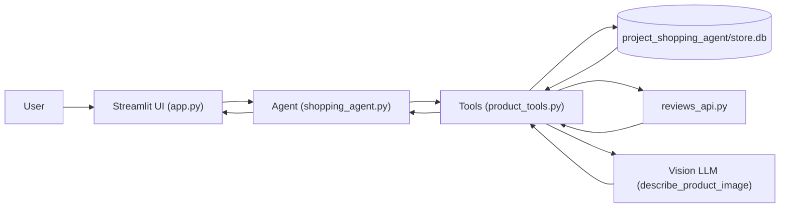

# Shopping Agent

AI Shopping Assistant — a Streamlit-based demo that uses an LLM-driven agent to search a small SQLite product catalog, show ratings, analyze uploaded product images, and place orders after explicit confirmation.

## Project Showcase


## What It Does

- Search products by natural language, category, price, and organic status
- Retrieve average ratings aggregated from a local `reviews` table
- Analyze an uploaded product image (vision LLM) and derive a search query
- Place an order (writes to the `orders` table) only after explicit user confirmation

## Architecture Overview

- `project_shopping_agent/app.py` — Streamlit UI and chat/image upload handling
- `project_shopping_agent/shopping_agent.py` — constructs the agent, loads LLM clients, and defines the system prompt/guardrails
- `project_shopping_agent/product_tools.py` — agent tools: `search_products`, `get_rating`, `checkout`, `describe_product_image`
- `project_shopping_agent/store_db.py` — SQLite access layer (reads `products`, writes `orders`)
- `project_shopping_agent/reviews_api.py` — aggregates ratings from the `reviews` table
- `project_shopping_agent/setup_db.py` — creates and seeds `store.db` with sample products, reviews, and an empty orders table

Flow (high level):



## Environment & API Keys

The project uses both a text/chat LLM and a vision-capable model for image analysis. Environment variables are loaded via `python-dotenv` (a `.env` file is supported).

Create a `.env` file at the project root or export the following variables in your shell:

```bash
# Chat LLM (Groq)
export groqapikey="your_groq_api_key"
export model="gpt-XXX"  # model name used with ChatGroq

# Vision LLM (Google Gemini via langchain_google_genai)
export googlegeminiapikey="your_google_api_key"
export visionmodel="models/vision-xxx"  # vision model name
```

Note: `shopping_agent.py` reads `groqapikey` and `model`. `product_tools.py` reads `googlegeminiapikey` and `visionmodel`.

## Quick Start (local)

1. (Optional) Create & activate a Python virtual environment. This repo includes `ai-env/` — to use it:

```bash
source ai-env/bin/activate
```

If you don't have a venv yet:

```bash
python3 -m venv ai-env
source ai-env/bin/activate
```

2. Install dependencies:

```bash
pip install -r requirements.txt
```

3. Create or refresh the SQLite database (this seeds sample products and reviews):

```bash
python project_shopping_agent/setup_db.py
```

4. Provide the required API keys (see above) or create a `.env` file at the repository root.

5. Start the Streamlit app:

```bash
streamlit run project_shopping_agent/app.py
```

Open the UI at the URL shown by Streamlit (commonly `http://localhost:8501`).

## Usage Notes

- Use the chat box to ask for products (e.g. "I want organic honey under $15 with 4+ rating"). The agent will call `search_products` and `get_rating` as needed and present a numbered list.
- Upload an image in the sidebar to trigger `describe_product_image`. The vision LLM returns a `search_query` and `is_organic` hint which the agent uses to search the catalog.
- The agent will never call `checkout` until you explicitly confirm an order (e.g. "yes" or "order number 2"). Orders are written to `project_shopping_agent/store.db` in the `orders` table.

## Developer Notes

- Database file location: `project_shopping_agent/store.db` (created by `setup_db.py`).
- Agent tools are defined in `project_shopping_agent/product_tools.py` and wrapped with `@tool` for use by the agent.
- The agent uses `python-dotenv` so `.env` at the repository root is a convenient place to store API keys during development.

## Troubleshooting

- If image analysis fails, verify `googlegeminiapikey` and `visionmodel` are set and reachable.
- If chat/LLM calls fail, verify `groqapikey` and `model` are set.
- To inspect orders or products manually, open the SQLite file `project_shopping_agent/store.db` with any SQLite client.

## What's Included / Learning Outcomes

- Example of combining a vision LLM and chat LLM in an agent-driven workflow
- Demonstrates safe checkout guardrails (explicit confirmation, sourcing `product_id` from assistant results)
- Small, seedable SQLite dataset for quick demos and testing
